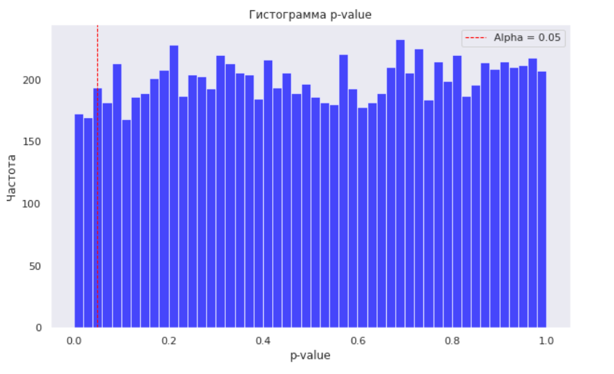

### "Проверка системы сплитования"

**Описание задачи:**  
Перед проведением А/А теста необходимо убедиться, что выполнены следующие условия:     
- разбиение было случайным;  
- у каждого пользователя в течение эксперимента группа не менялась;  
- способ разбиения должен быть детерминированным (чтобы можно было, если нужно, в точности повторить разбиение).  

Стандартная техника для такого разбиения — хэширование с солью. Разбиение по «соленому хэшу» гарантирует, что получившиеся группы будут случайны и приблизительно одинакового размера.    
Так как провести бесконечное число тестов вряд ли получится, поэтому используется следующий трюк. Многократно извлекаются подвыборки из данных, проводится t-test, а в конце смотрим, в каком проценте случаев удалось отклонить нулевую гипотезу.

**Цель:**  
Необходимо провести проверку системы сплитования с помощью А/А-теста, но перед этим нужно убедиться в том, что ключевая метрика не отличается между группами не только в конкретно А/А-тесте, но и в целом.

**Стек:**
Python (pandahouse, matplotlib, seaborn, scipy, hashlib), ClickHouse.

**Этапы работы**:  
- взяты данные А/А-теста следующего диапазона: с '2025-07-26' по '2025-08-01';  
- из групп 2 и 3 взяты подвыборки без возвращения размером в 500 юзеров;  
- группы сравнены с помощью t-test и сохранены p-value;  
- это повторено 10000 раз;  
- построена гистограмма получившихся p-value и посчитана доля p-value, оказавшихся ниже порога значимости в 0.05.

**Результат:**  
Распределение получившихся p-value является примерно равномерным, доля p-value ниже порога значимости составляет 0.044. Это примерно столько, сколько мы ожидаем. Значит, система сплитования работает корректно.  

Ознакомиться с файлом решения можно здесь: **[A-A_testing](https://github.com/NailyaGalina/Statistic_A-A_testing/blob/main/A-A%20testing.ipynb)**

