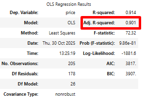

### "Предсказание стоимости машин с помощью регрессионного анализа"

**Описание задачи:**  

Дана база с информацией о характеристиках автомобилей.  
Необходимо сделать:  
1. Определить от каких факторов зависит ценообразование на автомобили.    
2. Определить, какие переменные важны для прогнозирования и насколько хорошо полученная модель описывает данные.  
3. Предсказать стоимость машин.  

**Цель:**    
Необходимо с помощью регрессионного анализа предсказать стоимость машин и понять, от каких факторов зависит ценообразование на автомобили.   

**Стек:**  
Python (pandas, urlib.parse, requests, statsmodels).  

**Этапы работы**:    
1. после некоторых преобразований данных была построена первая модель всего с одним предиктором цены: (price) – horsepower.  
Данная модель объясняет 65% изменчивости цен.      

2. затем была построена модель со всеми предикторами.    
Данная модель объясняет 95% изменчивости цен. Однако только 3 марки машин значимы в данной модели (p < 0.05)  

3. и наконец была построена модель со всеми предикторами, кроме марок машин.    
Данная модель объясняет 90% изменчивости цен. Среди предикторов 11 из 27 оказались не значимыми (p > 0.05)     

**Результат:**    
так как  Adj. R-squared в последних двух моделях изменился не значительно, то лучше выбрать модель без марок машин.  
Интерпретация (предсказание цены) при условии, что остальные переменные остаются неизменными:   
- при единичном изменении показателя horsepower, цена ВОЗРАСТАЕТ на 86.8164;    
- при единичном изменении показателя enginesize, цена ВОЗРАСТАЕТ на 36.0515;    
- при единичном изменении показателя wheelbase, цена ВОЗРАСТАЕТ на 71.1868  
и т.д.

Ознакомиться с файлом решения можно здесь: **[regression_analysis]( https://github.com/NailyaGalina/Statistic_Regression_analysis/blob/main/regression_analysis.ipynb)**  

 
 

*Проект разработан мной на основе материалов, автор которых - [karpov.courses](https://karpov.courses)

